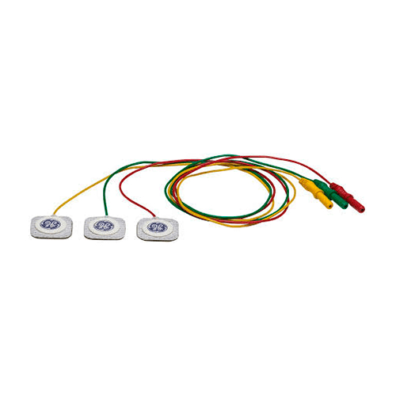
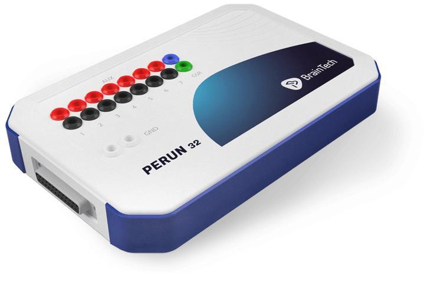
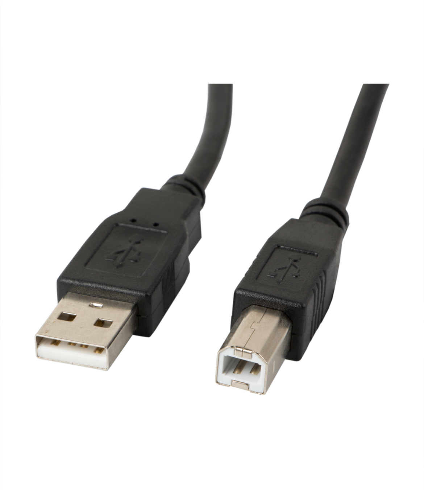

# APPreciation
Aplikacja pomagająca wejść w stan koherencji serca dzięki ćwiczeniom oddechowym.

**Koherencja serca** to stan głębokiego spokoju, w którym rytm serca synchronizuje się z oddechem. Tętno lekko przyspiesza podczas wdechu i zwalnia podczas wydechu. Pomóc w osiągnięciu tego stanu może ćwiczenie polegające na wykonywaniu wolnych i spokojnych oddechów. Korzyści z koherencji serca są liczne. Ciało i umysł regenerują się, poprawiają się pamięć i koncentracja, a także odczuwa się więcej pozytywnych emocji takich jak radość i wdzięczność. Dodatkowo obniżają się ciśnienie krwi i poziom kortyzolu, co w efekcie zmniejsza poziom stresu.

## Funkcje
* Ćwiczenie oddechowe, które pomoże zsynchronizować oddech z rytmem serca.
* Możliwość spersonalizowania długości wdechu i wydechu do indywidualnych potrzeb.
* Monitorowanie tętna oraz zmienności rytmu zatokowego.
* Wizualizacja poziomu koherencji serca

## Przygotowanie badanego

1. **Elektrody** 

Potrzebne będą 3 elektrody monopolarne z wtyczką Touch Proof wraz z nalepkami do EKG (rekomendujemy nalepki firmy SKINTACT). 
Poniżej znajdują się zdjęcia referencyjne. 

<div style="display: flex; justify-content: space-around;">
    
    
</div>

Elektrody należy umieścić na wewnętrznej części obu przedramion (elektrody bipolarne) oraz na wybranej nodze (najlepiej na wewnętrznej stronie, w pobliżu kostki) (referencja). Pamiętaj że przed przyklejeniem nalepki, skórę należy przemyć  alkoholem w celu zmniejszenia oporu (odtłuszczenia skóry). Ogranicz ruchy ciała, a przede wszystkim rąk do minimum. Najlepiej oprzyj je na podłokietnikach fotelx.

2. **Wzmacniacz**

Potrzebny będzie wzmacniacz Perun firmy BrainTech. Instrukcja obsługi;
https://braintech.pl/pliki/svarog/manuals/manual.pdf

<div style="display: flex; justify-content: space-around;">
    
    
</div>

Wzmacniacz podłącz do komputera kablem USB - USB B tzw. kabel drukarkowy.

3. **Podłączenie elektrod do wzmacniacza**

Elektrody, które umieszczono na przedramionach tj. „Bipolarne” podłącz do portu nr 1 na wzmacniaczu. Jedna idzie do czerwonego a druga do czarnego wejścia (wybór losowy). Elektrodę, którą umieszczono na nodze tj. „Referencje” podłącz do jednego z portów opisanych jako GND (ground). (Porty białe lub żółte)

## Instalacja

0. **Pobierz Svarog Streamer**

    Oprogramowanie Svarog Streamer znajdziesz pod linkiem:
    https://braintech.pl/software/svarog-streamer/

1. **Sklonuj repozytorium:**

   ```bash
   git clone git@gitlab.com:neuroinf_uw_24/ekg_coherence.git
   cd ekg_coherence
   ```

2. **Uruchom skrypt instalacyjny:**

    Dla macOS i Linux:
    ```bash
    bash setup.sh 
    ```
    Dla Windows:
    ```bat
    .\setup.bat      
    ```

3. **Aktywuj wirtualne środowisko:**

    Dla macOS i Linux:
    ```bash
    source .venv/bin/activate 
    ```
    Dla Windows:
    ```PowerShell
    .venv\Scripts\activate
    ```
## Uruchomienie aplikacji 
Aby uruchomić aplikację, użyj następujących poleceń w terminalu, dostosowując opcjonalne argumenty w zależności od potrzeb.

1. **Uruchom svarog_streamer:**

    Znajdź nazwę podłączonego wzmacniacza
    ```
    svarog_streamer -l 
    ```

    Wypisze listę wzmacniaczy. Szukamy ID odpowiedniego wzmacniacza np: 
    ```
    Perun-8 Headset
    id: "Perun8 1"
    ```

    W terminalu, uruchom svarog_streamer o podanych parametrach wpisując nazwę wzmacniacza, która pojawiła się w liście wzmacniaczy.
    ```
    svarog_streamer -a "Perun32 1" -n "nazwa_streamu" -s 500
    ```

2. **Uruchom aplikację APPreciation**
    Opcjonalne argumenty:

    --mode: Tryb uruchomienia aplikacji. Dostępne opcje: online, offline. (Wymagane)

    --chunk_size: Rozmiar fragmentu danych do przetwarzania. Domyślna wartość: 16.

    --Fs: Częstotliwość próbkowania. Domyślna wartość: 500.

    --channel: Numer kanału dla trybu online i offline. Domyślna wartość: 32.

    --s_path: Ścieżka do sygnału dla trybu offline. Domyślna wartość: test_perun.raw.

    Przykładowe uruchomienia
    Tryb online:

    ```bash
    python main.py --mode online --chunk_size 16 --Fs 500 --channel 23
    ```

    Tryb offline:

    ```bash
    python main.py --mode offline --chunk_size 16 --Fs 500 --n_ch 1 --channel 0 --s_path test_perun.raw
    ```


## Użycie aplikacji
1. Po uruchomieniu aplikacji naciśnij start w górnej części aplikacji, aby uruchomić pobieranie sygnału
2. Następnie naciśnij start przy schemacie oddechowym, aby rozpocząć ćwiczenie oddechowe.
3. Oddychaj zgodnie ze schematem: gdy piłeczka porusza się w górę weź wdech, gdy porusza się poziomo wstrzymaj oddech, a gdy porusza się w dół zrób wydech.
4. Jeśli prędkość oddychania Ci nie odpowiada, możesz zmienić ją w ustawieniach.

## Literatura
1. Materiały ze strony brain.fuw.edu.pl do Pracowni Sygnałów Bioelektrycznych
2. "The Coherent Heart" - publikacja Institute of HeartMath